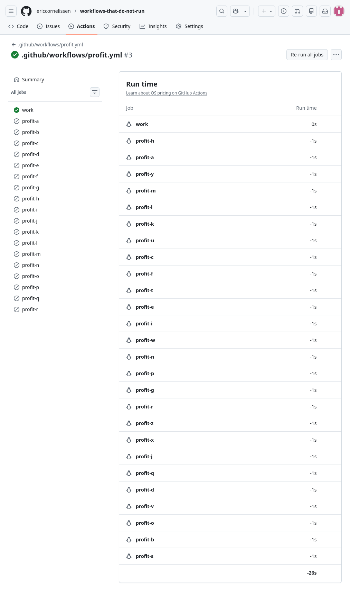

## What?

Due to a quirk in the GitHub Actions Runner(?), cancelled jobs sometimes
have a runtime of -1 second. As a result, given enough cancelled jobs,
you can create workflows that have [negative run time] - as shown above.

The behavior is not perfectly reproducible and sometimes cancelled jobs
have a runtime of 0s ([example][expected run time]). Also, not all
cancelled jobs in a workflow necessarily have the same run time
([example][mixed run time]).

[negative run time]: https://github.com/ericcornelissen/workflows-that-do-not-run/actions/runs/23607606365/usage
[expected run time]: https://github.com/ericcornelissen/workflows-that-do-not-run/actions/runs/23607792506/usage
[mixed run time]: https://github.com/ericcornelissen/workflows-that-do-not-run/actions/runs/23607872365/usage

## Why?

Is this useful? I don't know. One possibility is that you might be able
to avoid billable CI time using this strategy but I'm not going to test
that 🙃
